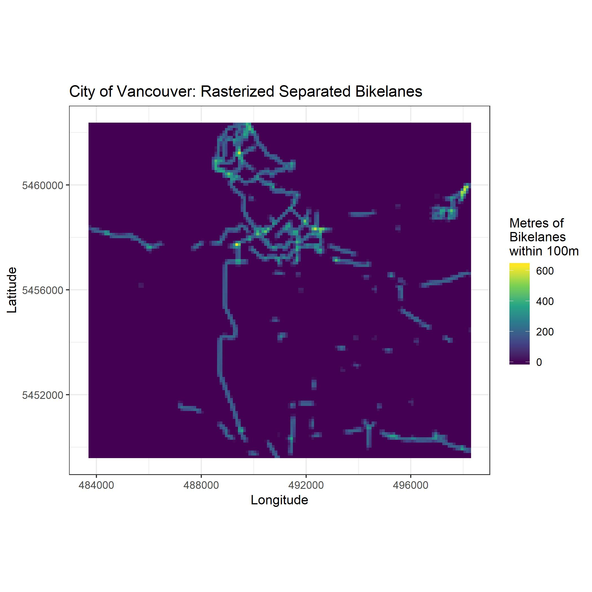

# Rasterize line vector data

As a part of a University level GIS course I taught I needed to generate some raster data for a lab exercise on map algebra. I decided to write a script to "rasterize" some vector data I already had on hand. This type of surface is common for the development of land use regression models, which require all input data to be continuous surfaces. For example, when developing a predictive surface for No2 concentrations, arterial road density within a given buffer length is likely an important predictor. Raster surfaces are created where every grid cell represents the line density of arterial roads within a given buffer size for the centroid of that grid cell. Here I develop a function to automate the process of creating such a surface in R using the sf package. 

The function "rasterize_lines" has 4 inputs:

1. Study area polygon
2. Polylines to be rasterized
3. Spatial resolution of the output raster
4. Buffer length from which to calculate line densities from each raster cell centroid. 

The function "rasterize_lines" takes the following steps to rasterize the polylines: 

1. Create empty raster surface of specified grid cell size and study area extent
2. Generate buffers of specified length from the centroid of the empty raster surface
3. Split the polylines by the centroid buffers layer
4. Sum the length of polylines within each buffer in the centroid buffers layer
5. Assign the length within each buffer to the associated raster
6. Output raster where each grid cell has the value of the length of the polylines within the specified buffer length of the cell centroid

# Example

Here we have a map of the City of Vancouver's separated bike lanes as input data:

## Input data
 
 

## Output surface
 
  

After running "rasterize_lines" the data have been converted to raster format. Each individual grid cell is assigned the the sum of the length of separated bike lanes within a 100m of its centroid. 
 
